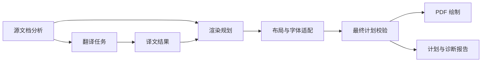

# 翻译架构：模块职责、数据契约与边界

日期：2026-10-04。

状态：目标架构设计稿。用户已确认主流程方向，并要求先记录完整职责与边界；本文不表示代码已完成迁移。文中的建议接口和新增文件名用于说明责任落点，不是已经存在的 API。

适用范围：英文 PDF 到中文 PDF 的源文档分析、翻译、渲染、质量检查、作业恢复和产物生成。保留 vector/raster 能力、源页与输出页的映射，以及非翻译内容的可追溯保护。

## 核心问题

当前流水线在多个阶段重新决定内容归属、渲染方式和布局策略，使源事实、翻译状态、绘制状态与诊断记录相互影响。

## 结论

源文档分析拥有稳定的内容分类和归属；翻译模块拥有译文及其状态；渲染规划拥有内容如何呈现的决策；布局模块拥有位置与字体适配；最终校验拥有结构有效性的判断；绘制和报告消费同一份最终计划。作业编排负责执行顺序、缓存生命周期和正式输出的替换。

## 最小正文

### 职责总表

下表描述逻辑职责。同一文件可以承载紧密相关的职责；流程节点不要求各自新增一个 Python 文件。模块应封装一类需要共同维护的知识。

| 节点 | 模块职责 | 输入 | 输出 | 决策边界 |
| --- | --- | --- | --- | --- |
| A | 源文档分析 | PDF、提取配置、必要的文档上下文 | 源内容、逐页尺寸、阅读关系、组件归属、分析问题 | 判断源内容是什么、属于哪里；不依赖译文存在与否 |
| B | 翻译任务 | A 的可翻译内容、组批策略、翻译配置 | 固定任务集合、模型原始响应、执行失败 | 决定翻译输入及请求上下文；不决定绘制位置和源分类 |
| C | 译文结果 | B 的响应、任务契约、跨块/跨页关系 | 可消费的最终译文、缺失或拒绝状态、修复记录 | 校验和整理译文；不修改源归属和页面几何 |
| D | 渲染规划 | A、C、输出模式与内容保留规则 | 带来源映射的渲染草案、允许的适配策略、覆盖义务 | 决定每类内容的呈现方式；不调用模型、不完成最终 fit |
| E | 布局与字体适配 | D 的草案、字体度量、逐页空间 | 最终绘制项、适配结果或明确失败 | 决定框、行、字号与间距；不改写译文含义、不重分类 |
| F | 最终计划校验 | A、C、E 的最终计划 | 结构化问题、是否允许绘制 | 基于最终状态检查；不修复计划、不重建分析 |
| G | PDF 绘制 | F 通过的计划、对应源资源 | 候选 PDF、绘制结果 | 执行计划；不重新决定归属、字号、裁剪范围或降级 |
| H | 计划与诊断报告 | 最终计划、F 的结果、后续 QA 结果 | JSON、Markdown、调试图片及产物索引 | 表达事实与检查范围；不反向改变内容和布局 |

作业编排、缓存读写、模型命令执行和可选 QA 是支撑职责，详见附录。它们通过上述契约工作，不自行增加一套内容分类或布局规则。

### 必须成立的边界

1. **源事实稳定。** 相同源内容与分析配置产生相同分析结果。译文缺失、模型切换、worker 数变化不改变源归属。
2. **分类、归属和绘制方式独立表达。** 正文降级为原文图片后，源分类仍为正文，缺译仍可被检查到。
3. **每次转换保留来源。** 一个绘制项可以引用多个源组件；一个源块可以按明确的片段关系拆分。合并、拆分后不能依赖绘制类型猜测归属。
4. **内容完整性可核对。** 所有非平凡源文本与视觉内容都有处理记录；跳过需要符合明确规则，unknown 内容必须保留并报告。
5. **最终状态决定校验结果。** 布局完成后重新计算几何和图层检查；先前的诊断不作为最终判断的缓存。
6. **计划、绘制和检查使用相同排版规则。** 字体选择、字号、换行与行高共享实现或消费同一份已计算结果。
7. **诊断不驱动排版。** `fallback_reason` 等原因信息只解释行为；布局权限与字体策略有明确字段。
8. **正式产物有明确完成条件。** 必需校验通过、候选 PDF 写入成功、所选 QA 策略满足后，才替换正式输出。

### 现状与目标的关系

当前两个 CLI 已共享 `pipeline.translate_document()` 和批次恢复/执行逻辑，vector 绘制与进程内 QA 也已交接实际最终计划；这些能力继续复用。[E1][E6]

vector 已在最终布局后统一刷新归属诊断，结构检查通过后才绘制，QA 保留 warning 的原严重度。[E4][E5]

绘制项现已通过 `layout_role` 表达布局关系、通过 `font_policy` 表达有限字号权限，原因文字只参与诊断说明。合流/拆分传递这些字段，样式检查核对角色和字号范围。[E3]

仍需调整的事实包括：源归属随译文状态重算、对象/JSON 双表示适配散布在 QA 中，以及仍仅依据 ID 重合接受缓存、正式输出写入早于可选 QA。[E2][E5][E7]

本文采用逐项收敛的路线。先补最终质量门，再迁移原因字段、统一源归属，随后收敛布局、序列化和文档编排。既有组批上下文和可选回译默认值在迁移期间保持现有用途；具体统一策略列入待讨论事项。

## 附录

### 证据索引

以下链接对应已检查的现有文件；稳定符号用于定位依据。已实现部分的验证记录见迁移顺序中的链接，其余验收条目仍为目标要求。

| 编号 | 已检查来源 | 支持的事实 |
| --- | --- | --- |
| E1 | [translation_batch.py](../../../translation_batch.py)：`execute_translation_batch`、`execute_json_task`、`validate_translation_payload` | 批次执行已集中；具备响应 ID、空译文和新鲜输出校验 |
| E2 | [pipeline.py](../../../pipeline.py)：`build_translation_page_components`、`final_visual_ownership_regions`、`build_translation_batches`、`build_page_render_plan` | 组批和渲染分别分析组件，渲染分析接收译文并改变视觉归属 |
| E3 | [layout.py](../../../layout.py)：`text_item_style_issues`、`text_item_font_size_bounds`、`split_translated_text_around_protected`；[pipeline.py](../../../pipeline.py)：`fit_body_flow_text_items`、`merge_adjacent_body_text_flows`、`normalize_vector_text_layout` | 布局与字体政策独立于诊断原因；最终布局修改几何/字号并保存权限；拆分保留元数据 |
| E4 | [pipeline.py](../../../pipeline.py)：`validate_final_page_plan`、`write_vector_pdf`、`validate_plan_quality`；[render_plan.py](../../../render_plan.py)：`validate_plan_ownership`、`validate_plan_layout` | 最终布局后刷新归属并统一检查覆盖、几何、文本重叠、样式和 fit；结构错误在绘制前阻断 |
| E5 | [qa_visual.py](../../../qa_visual.py)：`_plan_render_items`、`_item_value`、`detect_ownership_issues`、`generate_visual_qa_report`；[render_plan.py](../../../render_plan.py)：`PageRenderPlan`、`render_plan_to_json` | 检测逻辑兼容字典/对象；清理后归属 ledger 在导出时由组件生成 |
| E6 | [tests/test_final_render_plan.py](../../../tests/test_final_render_plan.py)：`FinalRenderPlanTests`；[README.md](../../../README.md)：QA Artifacts | 已有最终计划交接、实际页尺寸、输出页映射和跨页修复只应用一次的测试 |
| E7 | [translate_pdf_parallel.py](../../../translate_pdf_parallel.py)：`main`；[pipeline.py](../../../pipeline.py)：`translate_document`；[translation_batch.py](../../../translation_batch.py)：`run_batches`；[tests/test_translation_batch.py](../../../tests/test_translation_batch.py)：组批及低重合缓存测试 | 两入口组批与缓存接受策略不同；正式输出写入发生在可选 QA 之前 |
| E8 | [ownership.py](../../../ownership.py)：`PageComponent`、`ownership_ledger_to_json`、`validate_ownership`、`validate_render_layer_exclusivity` | 源归属、显式混合拆分和图层互斥已有实现基础 |
| E9 | [render_pdf.py](../../../render_pdf.py)：`preserve_images_on_page`、`render_plan_item`；[pipeline.py](../../../pipeline.py)：`write_vector_pdf`、`render_pages` | vector 目前会在计划绘制之外保留源图片；raster 有独立绘制路径 |
| E10 | [qa_semantic.py](../../../qa_semantic.py)：`run_backtranslation`、`build_report`；[qa_visual.py](../../../qa_visual.py)：`generate_visual_qa_report` | 回译、几何、源图裁剪检查和渲染 PNG 是不同检查手段，覆盖范围不同 |
| E11 | [tests/test_layout_stages.py](../../../tests/test_layout_stages.py)、[tests/pdf_render_fixture_runner.py](../../../tests/pdf_render_fixture_runner.py) | 已有部分内容守恒、布局稳定性及 fixture 断言；字符计数不能单独证明阅读顺序正确 |
| E12 | [AGENTS.md](../../../AGENTS.md)；[既有治理设计](2026-09-07-overengineering-options.md) | 内容保护、验证和提交约束；历史治理已完成的部分与保留的策略差异 |

### 补充材料

#### 1. 主流程及图示含义

这是核心内容的数据流。A 向 D 提供源归属和保留内容，C 向 D 提供可用译文，两者共同决定绘制策略。F 失败时仍向 H 输出失败计划和问题，G 只处理通过必需检查的计划。

G 之后可以运行依赖实际 PDF 的视觉 QA。其结果汇入 H，并交给作业编排判断是否接受候选 PDF。语义 QA 消费源内容与最终译文，不写回 C。诊断不会自动启动新的翻译或修改布局。

#### 2. 核心概念与数据契约

以下是目标数据含义，具体 Python 类型名称可以在实施时复用或调整现有记录。

| 概念 | 必须表达的信息 | 数据所有者与有效期 |
| --- | --- | --- |
| 源内容 | 源页号、文本块/视觉资产身份、文本或资源引用、原始区域、提取来源 | A；绑定具体源文档和提取结果 |
| 页面分析 `PageAnalysis` | 实际页尺寸、坐标约定、内容角色、组件、阅读与跨页关系、分析问题 | A；交给下游后只读 |
| 组件归属 | 哪些源内容或明确片段属于同一内容组件，以及拆分关系 | A；独立于是否成功翻译 |
| 内容角色 | title、heading、subheading、body、reference、header/footer、figure、formula、table、code、unknown | A；D/E/G 保持其可追溯性 |
| 翻译任务 | 目标源片段、原文、上下文、预期响应 ID、prompt/model 配置、输入身份 | B；worker 只能执行固定任务 |
| 译文结果 | 目标文本、来源映射、`ready/missing/rejected` 状态、规范化与边界修复记录 | C；交给 D 和 QA 的版本一致 |
| 渲染项 `RenderItem` | 来源引用、内容角色、实际绘制方式、文本或资源引用、几何、`style_name`、`layout_role`、`font_policy`、诊断原因 | D 建立；E 完成几何和 fit；F 后只读 |
| 最终页计划 `PageRenderPlan` | 源页号与输出页号、实际尺寸、完整绘制项、明确跳过记录、覆盖信息 | E 完成；F/G/H/QA 消费同一版本 |
| 检查问题 | 稳定代码、severity、阶段、源/组件/绘制项引用、位置与说明 | 对应校验模块生成；H 负责展示 |

身份与坐标必须满足以下约定：

- 源页号和输出页号分别记录，选择源页 5 并不意味着输出 PDF 也有第 5 页。
- 源几何统一为该页坐标系下的 PDF points；OCR 像素坐标在 A 中转换，转换比例和页面旋转信息有明确来源。
- 页面分析使用逐页尺寸，不能用第一页尺寸替代整份文档。
- 源 block ID 仅在对应源分析版本内有意义；缓存身份还必须包含实际输入依据。
- 混合图文允许一个提取块被拆成明确的不同区域或文本片段；无法可靠拆分时保留 unknown/歧义状态并报告。
- 合并后的绘制项可以来自多个组件，来源引用应能表达这种关系，不能只保留任意一个 `component_id`。
- 所有来源映射都支持反向核对：从一个源内容找到全部处理结果，从一个绘制项找到其源依据。

`ready` 表示满足输入输出契约和基本可用性检查，不代表已证明翻译语义完全正确。模型失败、缺译和不需要翻译是不同状态；不需要翻译的内容由源角色与翻译策略明确表达。

#### 3. A：源文档分析

**封装的知识：** 如何从 PDF 获得可供翻译和保留的内容，如何识别页面结构和源组件。

**输入：** PDF、提取/OCR 配置、页选择，以及识别重复页眉、参考文献延续和跨页句子所需的文档上下文。

**职责：**

- 管理文本提取、OCR 选择、逐页尺寸与旋转信息；记录提取降级的原因。
- 将提取结果、行几何和视觉资源统一为源内容引用。嵌入图片、无文本视觉区域、整页图片也需要身份和保留记录。
- 识别内容角色、阅读顺序、重复提取、组件归属及明确的混合拆分。
- 识别跨页上下文关系，供翻译使用；页选择只决定输出范围，不应无声改变已知源语义。
- 输出歧义和不支持内容的分析问题，并提供保守保留依据。

**输出：** 文档/页面分析及可读取的源资源引用。图像可按需读取，分析对象不必常驻整份文档的高分辨率图片。

**边界：** A 不接收译文，不依赖模型返回结果，不决定目标字号，不因正文翻译失败将正文重标为视觉内容。源角色和归属在内部分析收敛后才交给下游。

**错误处理：** 无法解析的非平凡内容不得消失；能够保留时输出显式 unknown 组件，连保留所需资源也不可用时返回分析失败。

**建议入口：** `analyze_document(pdf, extraction_options)`。现有 `classify.py`、`regions.py`、`ownership.py` 继续承载分类、视觉检测和归属知识；上层通过一个分析结果消费它们。

#### 4. B：翻译任务

**封装的知识：** 什么内容需要翻译，如何组成明确且可恢复的请求。

**输入：** A 的源内容及翻译选择、组批策略、模型与术语配置。

**职责：**

- 依据已确定的源角色和翻译策略选择内容，构造带上下文的任务。
- 确定任务边界、预期 ID、prompt 和 schema；页面归属不在此重新判断。
- 将组批与并发分开：先得到固定任务集合，再由编排安排 worker。
- 通过现有批次执行能力调用模型，记录执行日志和失败；拒绝把旧进程输出当成本次成功结果。

**输出：** 任务集合及对应响应/失败记录。B 与 C 可以由同一个翻译模块提供完整入口，避免调用方自行拼接执行和校验。

**边界：** B 不根据目标文本框容量改写翻译目标，不做删减摘要，不读取或改写 render plan；worker 数不是组批策略。

**建议入口：** `build_translation_tasks(analysis, translation_options)`；执行继续复用 `translation_batch.execute_translation_batch()`。

该入口属于翻译模块内部的组批能力。普通编排调用方只调用一个完整翻译入口，由它完成 B/C 的执行、响应校验与修复，不自行拼接中间状态。

#### 5. C：译文结果

**封装的知识：** 哪些响应可以作为译文使用，如何完成有依据的译文规范化和跨页修复。

**输入：** 原始任务、模型响应、A 提供的跨块/跨页关系；必要时由翻译模块执行专门的修复任务。

**职责：**

- 校验响应类型、ID 完整性、重复 ID、空译文等契约。对应纯校验逻辑继续在现有批次代码中复用。
- 明确区分 `ready`、`missing`、`rejected`，保留失败与拒绝原因。
- 根据源证据处理软换行、页眉混入等确定性规范化；不使用特定论文词句补写内容。
- 跨页修复只应用一次，记录修复输入、结果和来源对应关系。需要模型的修复仍属于翻译责任。
- 向 D 和语义 QA 提供同一份最终译文结果；原始响应保留为调试证据。

**输出：** 带来源映射的最终译文及状态。缺译不会通过复制英文变成 `ready`。

**边界：** C 不决定图片裁剪和排版，也不因修复跨页句子修改源组件归属。跨页内容在译文中的分配必须有记录，使后续覆盖核对能够区分合法迁移和内容丢失。

**建议入口：** `finalize_translations(analysis, task_results, repair_results)`；模型调用在翻译入口中完成后，最终整理函数可保持确定性。

#### 6. D：渲染规划

**封装的知识：** 如何根据内容角色和译文状态选择呈现方式，以及哪些降级可接受。

**输入：** A 的稳定分析、C 的最终译文、输出模式与当前内容保留策略。

**职责：**

- 为每个源内容建立明确的处理决策：译文文字、原文可选文字、原文图片、合规跳过或待报告失败。
- 保留 title/heading/body/reference 等内容角色，即使它们最终使用相同绘制方式。
- 确定标题、正文、页眉页脚等样式角色，以及正文流、callout、源段落等现有布局关系。
- 给出初始几何、不可侵犯的视觉内容范围和允许的适配策略；最终几何交给 E。
- 将源图片及其他保留内容纳入计划，覆盖当前 `preserve_images_on_page()` 在计划外绘制的内容。[E9]
- 建立覆盖义务：源内容需要被保留或翻译到什么程度，合法的拆分、跨项分配和跳过分别如何核对。

**输出：** 渲染草案。正文没有可用译文时，可以产生带原因的原文保留项，同时保留缺译状态，供质量策略判断是否可接受。

**边界：** D 不重新运行 A 的归属判断，不调用模型，不借助绘制失败临时发明降级。对于排版失败后允许选择的降级，D 先定义候选和允许条件。

**建议入口：** `build_render_plan(page_analysis, translations, render_options)`。输入不再同时携带数套可独立变化的分类、visual regions 和归属结果。

#### 7. E：布局与字体适配

**封装的知识：** 在真实页空间和字体度量约束下放置既定内容。

**输入：** D 的草案、对应页尺寸、字体资源、适配策略。

**职责：**

- 分配正文流、标题和锚点的空间；处理视觉保留区域与可用文字区域。
- 按明确的阅读关系合并或拆分绘制项，完整保留译文顺序和来源。
- 计算换行、字体选择、字号、行高与段落间距。fit 与 G 的绘字使用相同度量规则。
- 在 D 允许的范围内，选择正常排版、紧凑样式或明确降级；记录实际选择及原因。
- 保留视觉内容本体。允许修剪的 padding 与必须保护的源区域分别表达，不因文本难以放下裁掉源内容。

**输出：** 最终计划或明确的布局失败，包括失败项、空间需求和无法满足的约束。

**边界：** E 不补译、摘要、删除语义内容或重新分类。`fallback_reason` 不赋予任意缩字号、合流或跳过样式校验的权限。

实现可以在模块内部保留有依据的二次重排；顺序、作用及终止条件必须明确。有限候选全部失败后返回失败，不无限重复修复。重复执行的阶段只有在契约声明幂等时才要求幂等；不能通过重复运行整条链路碰运气。

文字的分段、换行与源映射属于排版操作；句子补全和语义重写属于 C，两者不得相互代替。

**建议入口：** `layout_page(draft, font_metrics)`。最终计划中的有效字体和度量依据应足以保证 G/F 使用同一结果；可以保存最终行布局，也可以复用同一个确定性 fit 实现。

#### 8. F：最终计划校验

**封装的知识：** 一个计划必须满足哪些内容与几何不变量，哪些问题属于必需阻断项。

**输入：** A、C、E 的最终计划，以及需要的源资源。不得用旧诊断快照代替重新计算。

**职责：**

- 核对源归属的完整性、唯一性和合法拆分；最终绘制项与归属关系必须一致。
- 将覆盖义务与实际绘制项、明确跳过记录进行匹配。仅有 `rendered=True` 或 source ID 集合不足以证明内容完整。
- 检查图文/文本互斥、边界、视觉裁剪范围、样式和文本 fit。
- 检查缺译、显式降级等内容质量状态，保留与结构性错误不同的代码和严重度。
- 生成基于最终状态的问题列表；文档级检查在所有相关页计划完成后执行。

**输出：** 结构化检查结果，包含代码、severity、位置和来源引用。只读检查不得改变计划；替换报告快照由编排或报告代码完成。

**阻断边界：** 源内容无记录丢失、非法重复归属、非法图层覆盖、越界/溢出等违反必需契约的问题，始终阻止正式输出。`--no-qa` 只影响可选检查。已记录的保守降级是否允许接受，由明确的质量策略决定；不将所有 warning 自动升级为 error。

阶段性分析问题与最终几何问题分别保存。最终几何修复成功后，旧重叠问题不能继续充当当前错误；保留下来的历史诊断应标明阶段。

**建议入口：** `validate_final_plan(page_analysis, translations, plan)`。它集中组织现有校验能力；领域规则继续由其真实所有者维护，避免每种报告重新实现判定阈值。

#### 9. G：PDF 绘制

**封装的知识：** 如何将经过校验的最终绘制项转换成 PDF 内容。

**输入：** 已通过必需检查的计划、绑定同一源文档的资源、输出模式。

**职责：**

- 按计划的页尺寸、页顺序、文字、字体、位置和裁剪范围绘制。
- 完成实际字体资源加载、图片读取、PDF 编码与保存；环境与资源失败明确报错。
- 使用已规划的书签/页映射，或保持已有确定性书签映射功能；不得在绘制期间新增模型翻译。
- 输出候选 PDF 与绘制结果，正式文件的接受和替换由作业编排完成。

**边界：** G 不补漏画内容、不偷偷缩字号、不在文字溢出时切换为图片、不新增未进入计划的视觉层。不同资源读取方式只有在保持同一绘制契约时才是内部实现细节；会改变内容或效果的替代必须显式记录。

当前 vector 会提前调用 `preserve_images_on_page()`，目标是将其内容发现与保护决策迁移到 A/D，G 只保留绘制能力。此项属于完整计划覆盖的迁移要求，尚未实施。[E9]

**建议入口：** `draw_document(plans, source_resources, candidate_path)`；底层继续复用 `render_pdf.py` 的能力。

#### 10. H：计划与诊断报告

**封装的知识：** 如何持久化计划与诊断，并让离线检查准确还原实际处理范围。

**输入：** 最终计划、源/翻译输入身份、阶段检查结果、绘制状态、可选 QA 结果及产物路径。

**职责：**

- 序列化计划、覆盖记录、归属记录、显式降级和检查结果。
- 在 JSON 加载边界校验结构并转成一种内部表示。检测函数不再各自适配字典/对象。
- 记录源页号、输出页号、实际尺寸、检查是否执行及原因；未检查不能显示为通过。
- 失败时也输出诊断，并区分源分析、草案、最终计划与实际 PDF 对应的检查范围。
- 从组件生成 ownership ledger；coverage ledger 核对实际绘制与源内容义务。两个 ledger 含义不同，不合并。

**输出：** 计划 JSON、质量报告、调试图片与索引。报告展示和排序可以变化，但不能改变校验代码、severity 或排版行为。

**边界：** H 不重建缺失计划，不以默认空列表掩盖损坏字段，不依据报告文案作业务判断。每份报告对应明确的计划版本，后续 QA 补充结果时不修改该计划。

**建议入口：** 复用现有计划 serializer，并增加明确的加载边界；报告使用现有专用写入函数，不引入通用报告插件体系。

#### 11. 作业编排、缓存和可选 QA

**作业编排**拥有 CLI 配置到执行参数的映射、阶段调用、worker 调度、失败恢复和产物接受。领域模块不反向 import CLI，也不读取全局 argparse 对象。串行与批量入口最终共享文档执行能力，但可以保留有明确用途的默认组批/QA 策略。

**缓存**由作业编排统一管理生命周期，各领域模块提供判断有效性所需的输入依据。缓存命中后仍需验证数据契约；执行命令失败不能接受上次残留响应。

| 缓存或产物 | 有效性依据 | 失效边界 |
| --- | --- | --- |
| 提取与源分析 | 源文档身份、实际提取结果/配置、相关分析规则版本 | 源内容或分析依据改变后重新分析 |
| 翻译响应 | 实际请求的原文、上下文、术语/prompt/schema、model 等相关配置 | 请求语义输入改变后重译；仅改变 worker 数不失效 |
| 边界修复 | 关联源片段、参与修复的译文、修复配置 | 原文或参与修复的译文改变后重新修复 |
| 最终计划 | 源分析、最终译文、布局/字体配置与输出模式 | 任一参与绘制决策的输入改变后重新规划 |
| QA 与正式输出 | 对应最终计划/PDF 身份、检查范围与质量策略 | QA 策略或产物改变后重新验收，不自动触发无关重译 |

任务上下文包括实际发送的完整批次内容；部分缓存命中时，剩余请求的上下文也必须记录。源 block ID、文件名和输入 ID 重合率不能独立证明翻译缓存仍有效。缓存不用抽象成任意依赖图，按已有产物定义具体规则即可。

**模型命令执行**封装命令参数、日志、新鲜输出、重试和进程失败。翻译、修复和回译各自拥有 prompt 与响应契约；几何、分类、归属、fit 等确定性任务不调用模型。

上表同时描述缓存与审计产物，不要求每一行都实现自动复用。优先缓存提取、OCR、模型调用等昂贵操作；最终计划和 QA 报告先作为可追溯产物保存，只有实际性能需求出现后再增加复用规则。

**语义 QA**消费 A 与 C 的最终结果，输出可疑翻译和回译依据。现有回译字符串相似度属于检查线索，不代表语义正确率。QA 不自动改写译文。[E10]

**视觉 QA**消费最终计划、源资源和实际候选 PDF；明确区分计划几何检查、源裁剪内容检查和真正读取输出像素的检查。生成 PNG 本身不表示完成了输出像素校验。与 F 相同的领域规则共享判定逻辑，输出图像检查保留独立证据。

候选输出生命周期为：生成最终计划 → 必需校验 → 绘制候选 PDF → 执行所选 QA → 按策略接受 → 替换正式输出。失败报告和候选产物可保留供诊断，但不得作为下次运行“已完成”的唯一依据。

#### 12. vector 与 raster 的边界

源分析、翻译任务和最终译文可以共享。两种模式的测量和绘制能力不同，布局与 fit 校验必须对应实际绘制模式。

- vector 使用 PDF 字体度量和对应绘字规则；raster 使用实际像素字体度量、背景处理及像素布局。
- 两种模式都应能记录实际绘制项、来源、显式降级和最终几何，字段按已有需求扩展。
- raster 当前返回空 plans，并使用源布局诊断；这是现状限制，不能将 vector 诊断重命名为 raster 最终计划校验。[E6][E9]
- 迁移可先完成 vector 的质量门，再让 raster 暴露实际绘制结果。每种模式的验收范围单独标注，未迁移模式不得被报告为已满足全部最终计划契约。
- 不要求两个后端使用相同字体算法；要求每个后端的 fit 与其实际绘制一致。

#### 13. Python 责任落点与依赖方向

KISS 实施约束：A–H 描述责任，调用方只需掌握源分析、完整翻译、最终计划生成、绘制与报告入口。D/E/F 由一个生成最终计划的入口封装，规划、适配和校验仍可保留可测试的内部函数。译文与计划不按阶段新增包装类；失败原因保留在现有结果和诊断记录中。候选文件仅在迁移实质代码时创建。

下表是建议落点。标记“候选新增”的文件尚不存在，不是当前源码事实；应在迁移具体职责时创建，不提前建立空壳。

| 责任 | 现有承载 | 建议落点 |
| --- | --- | --- |
| 源读取与分析入口 | 单文件 pipeline 中的提取/OCR/组件组装；`classify.py`、`regions.py`、`ownership.py` | `source_document.py`（候选新增）提供完整源分析入口，复用三个领域模块 |
| 翻译生命周期 B/C | `pipeline.py` 的统一组批与边界修复、`translation_batch.py` 的恢复与调度 | `translation.py`（候选新增）拥有组批与结果整理；保留具体批次执行模块 |
| 计划记录与 codec | `render_plan.py` | 继续承载计划数据契约和序列化；避免反向 import CLI |
| 渲染决策 D | `build_page_render_plan` 及大量辅助函数 | `render_planning.py`（候选新增），消费源分析与译文，构造草案 |
| 排版与字体 E | `layout.py` 及 pipeline 中布局函数 | 收敛到 `layout.py`；先收敛责任再移动代码 |
| 最终校验 F | `render_plan.py`、`layout.py`、pipeline 与 QA 中的校验 | `plan_validation.py`（候选新增）集中最终入口，复用领域判定函数 |
| 绘制 G | `render_pdf.py` 及 pipeline 中两种绘制入口 | `render_pdf.py` 与必要的后端具体实现 |
| 报告与 QA H | 计划 codec、`qa_visual.py`、`qa_semantic.py`、`pipeline.py` 的 QA 编排 | 复用专用报告函数，隔离 JSON 适配和检测逻辑 |
| 作业编排与缓存生命周期 | `pipeline.py`、`translation_batch.py`；两个 CLI 负责参数与文档调度 | 已实现统一文档入口；后续治理缓存身份和候选输出接受条件 |

依赖原则：共享数据记录与度量函数位于较低层；规划、布局、校验和绘制按需依赖它们。CLI 调用编排，编排调用具体模块；源分析不依赖翻译，翻译不依赖渲染，绘制不依赖模型执行。报告读取领域结果，不成为领域代码的反向依赖。

2026-10-04 清理批次的契约变化：

- `PageComponent` 删除未参与决策的 `render_strategy`；实际绘制方式继续由 `RenderItem.kind` 和覆盖账本记录。
- 计划导出的 `ownership_ledger` 从当前组件生成，删除独立内存副本及固定的 `ownership_role="owner"` 字段。归属、置信度、原因与覆盖检查继续保留。
- 回译共用 `translation_batch.execute_json_task()`，重试时要求新鲜且契约有效的输出。原始响应文件统一为 `backtranslate-NN.out.json`，新增对应 prompt 产物；日志及最终 JSON/Markdown 报告路径保持。
- 删除无消费者函数、浅包装及无用参数。随后两个 CLI 已统一到 `pipeline.translate_document()`，核心实现迁出原 CLI 脚本，Python 消费者直接导入实际模块。

共享文档执行批次保留了现有策略默认值：单文件跨页组批、缓存阈值 0.6、默认不运行可选 QA；批量按页组批、缓存阈值 0、默认运行 QA。`DocumentOptions` 显式记录组批、缓存和 QA 配置，worker 数仅控制执行并发。两个入口共用固定 `TranslationBatch(prefix, items)` 和 `run_batches()`，缓存逐批原子写入。单文件的旧缓存备份名统一为 `translations.stale-<timestamp>.json`，空页选择统一明确失败。仍需实施的内容指纹缓存和正式输出质量门没有由这次编排合并自动完成。

特别避免把计划构建直接塞回被 `layout.py` import 的数据模块并引入循环 import。上述候选文件承担从现有大模块迁出的真实职责；不增加 registry、服务容器、抽象基类或可注册 pass 框架。

#### 14. 验收条件与迁移顺序

| 次序 | 可独立审查的变更 | 必须观察到的结果 |
| --- | --- | --- |
| 1 | vector 最终质量门及诊断刷新（本轮已实现，见下方记录） | 缺失/重复归属即使关闭可选 QA 也失败；最终已修复的重叠不再沿用旧错误；warning 不被整体升级 |
| 2 | 原因与控制字段解耦（已实现，见下方记录） | 修改原因说明不改变布局；字体例外具有明确范围，合法原因不能豁免任意字号 |
| 3 | 源分析结果共享 | 译文为空、有效、无效时源归属相同；组批和渲染使用同一页尺寸、源身份与分析结果 |
| 4 | 布局责任收敛 | 合并/拆分保留文本顺序与来源；未知内容不丢失；已有必要二次重排保持；删除步骤有 fixture 对照 |
| 5 | codec 与派生记录清理 | 同一计划经 JSON 往返后得到相同诊断代码/severity/来源；损坏或缺失字段明确失败 |
| 6 | 文档编排与缓存统一 | 固定任务在不同 worker 数下结构一致；源输入改变不误用旧缓存；失败候选不会被当成正式完成产物 |
| 7 | raster 实际计划与对应校验 | 检查消费真实像素布局；测量与绘制规则一致；报告不再借用 vector 计划证明 raster 有效 |

关键 fixture 应覆盖：多栏、混合页尺寸、页子集、跨页句子、图文混合块、无文本图片页、标题/正文/参考文献、unknown、缺译、无法 fit 及合法显式降级。所有结构和渲染验收应能使用预制译文运行，无需在线模型。

第 1 项实现记录见 [最终计划校验收敛](../plans/2026-10-04-final-plan-validation.md)。`pipeline.validate_final_page_plan()` 在最终布局后统一刷新归属并收集必需校验结果；`render_plan.validate_plan_layout()` 只负责几何，源归属及图层互斥归 `validate_plan_ownership()`。绘制前的结构检查不依赖可选 QA，QA 保留每条诊断的原严重度。完整内容守恒、计划外源图片及可选 QA 失败后的正式产物发布仍属于后续责任收敛范围。

第 2 项实现记录见 [布局行为与诊断原因解耦](../plans/2026-10-04-layout-policy-separation.md)。`layout_role` 和 `font_policy` 为有限数据字段，不增加策略插件或阶段对象。原因不能绕过角色/字号检查；内存与 JSON 计划消费同一规则。旧 JSON 缺少字段时按普通布局/文档字体检查，特殊计划需要重建以记录权限。既有合法绘制样例的最终几何和 PNG 与改动前一致。

每项修改使用聚焦回归保护其契约。内容守恒需要同时检查来源覆盖、文本顺序和合法规范化，不能只比较字符计数。绘制与视觉 QA 的变更必须写出计划、实际 PDF/PNG 和报告，检查问题数与产物对应关系。

代码提交前运行 [AGENTS.md](../../../AGENTS.md) 规定的完整回归及编译检查，并包含涉及的 ownership、translation batch、final render plan、layout stages 等新增或相关测试。各批次运行结果、既有失败和跳过项以对应实施记录为准。

#### 15. 取舍与维护要求

仅增加更多校验能封堵部分错误，但仍需维护多套决策；一次重写分类和布局可能破坏已覆盖的复杂 PDF。当前选择逐项建立契约、复用现有规则、再删除重复责任。

按前述设计框架，初审基线为 6/10，当前整体架构为 7/10，均为静态审查判断。共享文档流程、最终质量门和原因解耦已减少重复责任；继续提升需要稳定的源分析交接、完整内容守恒、明确的缓存身份与正式产物接受、对应实际输出的 raster 检查。达到目标要求以职责是否被真实封装为依据：每种决策有唯一所有者、原因不控制行为、上下游通过明确数据交接、检查对应实际输出、改动不需要同步修改多套规则。文件数和行数不作为评分依据。

边界改变后，同步更新本文件、公开数据契约和相关 fixture。新增 heuristic 必须说明保护的不变量和避免的失败模式；不能通过特定论文、页码或临时输出路径规避边界。

### 待讨论事项

- **问题：** 共享文档执行入口后，单文件与批量入口是否最终统一组批边界？
- **已知证据：** 当前单文件可以跨页组批，批量入口按页组批；已有测试明确保护该差异。[E7]
- **缺失证据：** 翻译上下文连续性、请求数量和页级恢复粒度之间的产品优先级。
- **影响：** 决定两种现有策略是否长期保留；不阻碍先分离组批与 worker 调度。

- **问题：** 单文件入口的可选语义/视觉 QA 默认值是否应与批量入口一致？
- **已知证据：** 两入口现已共用 `translate_document()` 的 QA 调用链；单文件 CLI 默认关闭可选 QA，批量 CLI 默认开启。[E4][E7]
- **缺失证据：** 对额外模型调用成本、运行时间和默认质量策略的取舍。
- **影响：** 决定 CLI 默认行为；所有入口必须执行的结构校验不依赖该决定。

- **问题：** 是否存在还应阻止非 strict 模式输出的内容质量问题，例如明确记录的正文原文保留？
- **已知证据：** 当前实现支持显式 fallback，并用 strict QA 控制部分质量问题是否使任务失败。[E4][E7]
- **缺失证据：** 各类已记录降级在探索输出和正式验收中的接受规则。
- **影响：** 决定内容质量策略的阻断范围；非法覆盖、无记录丢失和结构不完整仍属于必需错误。
