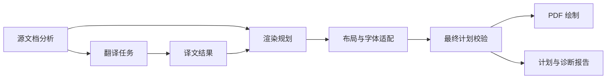

# 翻译架构：模块职责、数据契约与边界

日期：2026-10-04。

状态：目标职责与现状对照。A–H 是逻辑责任，不对应固定文件或逐阶段公开接口；未完成的目标在文中单独标明。

适用范围：英文 PDF 到中文 PDF 的源文档分析、翻译、渲染、质量检查、作业恢复和产物生成。保留 vector/raster 能力、源页与输出页的映射，以及非翻译内容的可追溯保护。

## 核心问题

当前流水线在多个阶段重新决定内容归属、渲染方式和布局策略，使源事实、翻译状态、绘制状态与诊断记录相互影响。

## 结论

源文档分析拥有内容分类和归属；翻译模块拥有最终译文；渲染规划决定呈现方式，布局负责位置与字体适配；最终校验判断计划能否绘制，绘制和报告消费该计划。作业编排负责执行顺序、昂贵操作的缓存和输出结果处理。

## 最小正文

### 职责总表

下表描述逻辑职责。同一文件可以承载紧密相关的职责；流程节点不要求各自新增一个 Python 文件。模块应封装一类需要共同维护的知识。

| 节点 | 模块职责 | 输入 | 输出 | 决策边界 |
| --- | --- | --- | --- | --- |
| A | 源文档分析 | PDF、提取配置、必要的文档上下文 | 源内容、逐页尺寸、阅读关系、组件归属、分析问题 | 判断源内容是什么、属于哪里；不依赖译文存在与否 |
| B | 翻译任务 | A 的可翻译内容、组批策略、翻译配置 | 固定任务集合、模型原始响应、执行失败 | 决定翻译输入及请求上下文；不决定绘制位置和源分类 |
| C | 译文结果 | B 的响应、任务契约、跨块/跨页关系 | 可消费的最终译文、缺失或拒绝状态、修复记录 | 校验和整理译文；不修改源归属和页面几何 |
| D | 渲染规划 | A、C、输出模式与内容保留规则 | 带来源映射的渲染草案、允许的适配策略、覆盖义务 | 决定每类内容的呈现方式；不调用模型、不完成最终 fit |
| E | 布局与字体适配 | D 的草案、字体度量、逐页空间 | 最终绘制项、适配结果或明确失败 | 决定框、行、字号与间距；不改写译文含义、不重分类 |
| F | 最终计划校验 | A、C、E 的最终计划 | 结构化问题、是否允许绘制 | 基于最终状态检查；不修复计划、不重建分析 |
| G | PDF 绘制 | F 通过的计划、对应源资源 | PDF、绘制结果 | 执行计划；不重新决定归属、字号、裁剪范围或降级 |
| H | 计划与诊断报告 | 最终计划、F 的结果、后续 QA 结果 | 计划、诊断报告及按需调试产物 | 表达事实与检查范围；不反向改变内容和布局 |

作业编排、缓存读写、模型命令执行和可选 QA 是支撑职责，详见附录。它们通过上述契约工作，不自行增加一套内容分类或布局规则。

### 必须成立的边界

1. **源事实稳定。** 相同源内容与分析配置产生相同分析结果。译文缺失、模型切换、worker 数变化不改变源归属。
2. **分类、归属和绘制方式独立表达。** 正文降级为原文图片后，源分类仍为正文，缺译仍可被检查到。
3. **每次转换保留来源。** 一个绘制项可以引用多个源组件；一个源块可以按明确的片段关系拆分。合并、拆分后不能依赖绘制类型猜测归属。
4. **内容完整性可核对。** 所有非平凡源文本与视觉内容都有处理记录；跳过需要符合明确规则，unknown 内容必须保留并报告。
5. **最终状态决定校验结果。** 布局完成后重新计算几何和图层检查；先前的诊断不作为最终判断的缓存。
6. **计划、绘制和检查使用相同排版规则。** 字体选择、字号、换行与行高共享实现或消费同一份已计算结果。
7. **诊断不驱动排版。** `fallback_reason` 等原因信息只解释行为；布局权限与字体策略有明确字段。
8. **失败不得伪装成完成。** 必需结构校验失败不能覆盖既有 PDF；可选 QA 对输出接受的影响仍需确定。

### 现状与目标的关系

当前两个 CLI 已共享 `pipeline.translate_document()` 和批次恢复/执行逻辑，vector 绘制与进程内 QA 也已交接实际最终计划；这些能力继续复用。[E1][E6][E7]

vector 已在最终布局后统一刷新归属诊断，结构检查通过后才绘制，QA 保留 warning 的原严重度。[E4][E5]

绘制项现已通过 `layout_role` 表达布局关系、通过 `font_policy` 表达有限字号权限，原因文字只参与诊断说明。合流/拆分传递这些字段，样式检查核对角色和字号范围。[E3]

文档入口已复用独立于译文的源分析；`translate_pages()` 在返回前完成边界修复及纯文本整理。原始响应缓存不被修改，渲染与 QA 使用最终译文。[E2][E6]

OCR 坐标按每个源页的实际尺寸换算，提取缓存版本已递增。独立编号与标题的组合分类由源分析决定；页脚保留源卷期和日期，一致性检查只比较样式。缺译由渲染显式保留并报告，不再生成补译。[E13]

源图片现通过出现位置 ID、绘制项和覆盖记录进入布局及最终校验。重复覆盖复用已有视觉裁剪；透明、分组和叠放图片在规划时选择源页裁剪。保留现有背景图及边缘图标过滤政策。[E9]

JSON 计划在 `render_plan.py` 的加载边界转成 `PageRenderPlan`，QA 与归属校验只消费对象。`coverage` 保存源覆盖义务与显式跳过决策；覆盖结果和保护区域从实际绘制项推导，不再同步写入多份状态。视觉组件的覆盖仍必须由图片裁剪满足，即使 OCR 文字属于平凡内容；同源同组件的文字绘制项不能替代视觉内容。[E5]

布局先依据移动前的位置整理包含片段、编号连续关系及短片段，再拆分避障与压缩几何；压缩后不再重新推断文本关联。新增图片 fallback 时才再次避障，最终字体适配保留内容及顺序。[E3][E11]

绘制项现通过 `text_spans` 记录最终译文去空白后的字符区间及来源组件；仅明确分成视觉与正文的源组件记录已规划的正文片段。布局拆合传递区间，最终检查重复、遗漏、单源片段顺序及标点/大小写变化。带完整有序 source IDs 的封闭正文合流还检查跨源顺序；这些区间不证明原文与译文的细粒度对齐或全局阅读顺序。[E13]

视觉 QA 与回译独立执行，`qa_summary.json` 记录完成或失败状态，再应用 strict QA 政策。正式输出仍写入于可选 QA 之前，输出接受政策没有改变。[E7][E13]

已实现的变更由实施记录追踪；未完成的边界与验收条件见下文。两个入口默认按页组批并共用缓存校验，可选 QA 默认值仍由各入口决定。

## 附录

### 证据索引

以下链接对应已检查的现有文件；稳定符号用于定位依据。已实现部分的验证记录见实施记录，其余验收条目仍为目标要求。

| 编号 | 已检查来源 | 支持的事实 |
| --- | --- | --- |
| E1 | [translation_batch.py](../../../translation_batch.py)：`execute_translation_batch`、`execute_json_task`、`validate_translation_payload` | 批次执行已集中；具备响应 ID、空译文和新鲜输出校验 |
| E2 | [pipeline.py](../../../pipeline.py)：`analyze_selected_pages`、`build_translation_page_components`、`build_translation_batches`、`build_page_render_plan` | 文档入口复用源分析；直接调用 helper 时允许按相同源输入重建；译文状态不决定源归属 |
| E3 | [layout.py](../../../layout.py)：`text_item_style_issues`、`text_item_font_size_bounds`、`split_translated_text_around_protected`；[pipeline.py](../../../pipeline.py)：`fit_body_flow_text_items`、`merge_adjacent_body_text_flows`、`normalize_vector_text_layout` | 布局与字体政策独立于诊断原因；最终布局修改几何/字号并保存权限；拆分保留元数据 |
| E4 | [pipeline.py](../../../pipeline.py)：`validate_final_page_plan`、`write_vector_pdf`、`validate_plan_quality`；[render_plan.py](../../../render_plan.py)：`validate_plan_ownership`、`validate_plan_layout` | 最终布局后刷新归属并统一检查覆盖、几何、文本重叠、样式和 fit；结构错误在绘制前阻断 |
| E5 | [qa_visual.py](../../../qa_visual.py)：`detect_ownership_issues`、`generate_visual_qa_report`；[render_plan.py](../../../render_plan.py)：`render_plan_from_json`、`PageRenderPlan`、`CoverageSource`、`render_plan_to_json` | JSON 在加载边界转换；QA 使用统一对象；覆盖结果及保护区域由最终 items 推导，归属 ledger 在导出时由组件生成 |
| E6 | [tests/test_final_render_plan.py](../../../tests/test_final_render_plan.py)：`FinalRenderPlanTests`；[README.md](../../../README.md)：QA Artifacts | 已有最终计划交接、实际页尺寸、输出页映射、最终译文出口及跨页修复只应用一次的测试 |
| E7 | [translate_pdf_parallel.py](../../../translate_pdf_parallel.py)：`main`；[pipeline.py](../../../pipeline.py)：`translate_document`；[translation_batch.py](../../../translation_batch.py)：`run_batches`；[tests/test_translation_batch.py](../../../tests/test_translation_batch.py)：组批与缓存测试 | 两入口默认按页组批，共用按实际请求校验的缓存；正式输出写入发生在可选 QA 之前 |
| E9 | [render_pdf.py](../../../render_pdf.py)：`source_image_items`、`render_plan_item`；[pipeline.py](../../../pipeline.py)：`add_source_images_to_plan`、`write_vector_pdf`、`render_pages` | vector 源图片进入布局前的计划和覆盖记录；按原始图片边界检查最终覆盖；raster 有独立绘制路径 |
| E10 | [qa_semantic.py](../../../qa_semantic.py)：`run_backtranslation`、`build_report`；[qa_visual.py](../../../qa_visual.py)：`generate_visual_qa_report` | 回译、几何、源图裁剪检查和渲染 PNG 是不同检查手段，覆盖范围不同 |
| E11 | [tests/test_layout_stages.py](../../../tests/test_layout_stages.py)、[tests/pdf_render_fixture_runner.py](../../../tests/pdf_render_fixture_runner.py) | 已有部分内容守恒、布局稳定性及 fixture 断言；字符计数不能单独证明阅读顺序正确 |
| E12 | [AGENTS.md](../../../AGENTS.md)；[既有治理设计](2026-09-07-overengineering-options.md) | 内容保护、验证和提交约束；历史治理已完成的部分与保留的策略差异 |
| E13 | [tests/test_architecture_contracts.py](../../../tests/test_architecture_contracts.py)；[KISS 修复记录](../plans/2026-10-04-kiss-contract-fixes.md) | 逐页 OCR、源分类、原页脚、译文区间及独立 QA 的回归与验证记录 |

### 补充材料

#### 1. 主流程及图示含义

这是核心内容的数据流。A 向 D 提供源归属和保留内容，C 向 D 提供可用译文，两者共同决定绘制策略。F 失败时仍向 H 输出失败计划和问题，G 只处理通过必需检查的计划。

G 之后可以运行依赖实际 PDF 的视觉 QA，其结果汇入 H。语义 QA 消费源内容与最终译文，不写回 C；诊断不会自动启动翻译或修改布局。可选 QA 是否决定正式输出的接受仍待讨论。

#### 2. 核心概念与数据契约

以下是目标数据含义，具体 Python 类型名称可以在实施时复用或调整现有记录。

| 概念 | 必须表达的信息 | 数据所有者与有效期 |
| --- | --- | --- |
| 源内容 | 源页号、文本块/视觉资产身份、文本或资源引用、原始区域、提取来源 | A；绑定具体源文档和提取结果 |
| 页面分析结果 | 实际页尺寸、坐标约定、内容角色、组件、阅读与跨页关系、分析问题 | A；交给下游后只读 |
| 组件归属 | 哪些源内容或明确片段属于同一内容组件，以及拆分关系 | A；独立于是否成功翻译 |
| 内容角色 | title、heading、subheading、body、reference、header/footer、figure、formula、table、code、unknown | A；D/E/G 保持其可追溯性 |
| 翻译任务 | 目标源片段、原文、上下文、预期响应 ID、prompt/model 配置、输入身份 | B；worker 只能执行固定任务 |
| 译文结果 | 目标文本、来源映射、缺失或拒绝信息、规范化与边界修复记录 | C；交给 D 和 QA 的版本一致 |
| 渲染项 `RenderItem` | 来源引用、内容角色、实际绘制方式、文本或资源引用、几何、`style_name`、`layout_role`、`font_policy`、诊断原因 | D 建立；E 完成几何和 fit；F 后只读 |
| 最终页计划 `PageRenderPlan` | 源页号与输出页号、实际尺寸、完整绘制项、明确跳过记录、覆盖信息 | E 完成；F/G/H/QA 消费同一版本 |
| 检查问题 | 稳定代码、severity、阶段、源/组件/绘制项引用、位置与说明 | 对应校验模块生成；H 负责展示 |

身份与坐标必须满足以下约定：

- 源页号和输出页号分别记录，选择源页 5 并不意味着输出 PDF 也有第 5 页。
- 源几何统一为该页坐标系下的 PDF points；OCR 像素坐标在 A 中转换，转换比例和页面旋转信息有明确来源。
- 页面分析使用逐页尺寸，不能用第一页尺寸替代整份文档。
- 源 block ID 仅在对应源分析版本内有意义；缓存身份还必须包含实际输入依据。
- 混合图文允许一个提取块被拆成明确的不同区域或文本片段；无法可靠拆分时保留 unknown/歧义状态并报告。
- 合并后的绘制项可以来自多个组件，来源引用应能表达这种关系，不能只保留任意一个 `component_id`。
- 所有来源映射都支持反向核对：从一个源内容找到全部处理结果，从一个绘制项找到其源依据。

可用译文只表示满足输入输出契约和基本检查，不代表语义完全正确。模型失败、缺译和不需要翻译必须能够区分；不需要翻译由源角色与翻译策略表达，不要求预建一套状态枚举。

#### 3. A：源文档分析

- 管理提取、OCR、逐页尺寸与旋转，给文本和视觉资源建立稳定身份、内容角色、阅读关系及组件归属；译文状态不得改变这些源事实。
- 识别重复页眉、参考文献延续与跨页句子等需要文档上下文的关系。页选择只决定输出范围，不应无声改变已知源语义。
- 对无法解析的非平凡内容保守保留并报告；保留所需资源也不可用时明确失败。无文本视觉区域和混合图文同样需要来源记录。

#### 4. B/C：翻译任务与译文结果

- B 根据 A 的源角色建立固定任务、上下文、预期 ID 和请求契约；worker 数只控制执行并发，不改变任务内容或源归属。
- C 校验响应的类型、ID、重复和空译文，区分可用译文、缺失、拒绝与无需翻译。确定性的文本规范化依据源证据，不用论文词句补写内容。
- 跨页修复只应用一次，并记录原片段与结果的关系；需要模型的修复仍属于翻译。原始响应作为证据保存，D 与语义 QA 消费同一份最终译文。
- B/C 可由一个翻译模块提供完整入口；普通编排调用方不拼接原始响应、校验和修复结果。翻译不决定裁剪、字号或页面归属。

#### 5. D/E：渲染规划与布局适配

- D 根据 A 的源内容和 C 的最终译文，为每项内容选择译文、原文保留、显式跳过或失败，保留内容角色、来源映射与覆盖义务。源图片等非翻译内容也应进入计划。[E9]
- D 定义可接受的适配范围和降级条件；E 使用逐页空间与真实字体度量确定框、行、字号和间距。fit 与实际绘制使用相同规则。
- E 可按阅读关系合并或拆分绘制项，但必须保持文本顺序与来源；视觉内容本体不得因文字难以放下而被裁掉。
- 降级必须在允许范围内并明确记录。布局不得补译、摘要或重分类；原因文字不赋予额外排版权限。有限调整失败后返回明确失败。

#### 6. F：最终计划校验

- 在最终布局后重算归属、覆盖、图层互斥、边界、视觉保护、样式和 fit；旧诊断不能代替最终判断。
- 非平凡内容无记录丢失、非法重复归属或越界等结构错误阻止绘制，与可选 QA 开关无关。缺译及显式降级另报内容质量问题，是否阻断由质量策略决定；warning 不因整体失败自动升级。
- 一次收集检查问题及来源，失败时也尽力保存诊断。校验只读，报告代码负责展示；历史阶段问题须标明阶段，不能冒充最终错误。

#### 7. G：PDF 绘制

- 只按通过校验的计划绘制文字、图片、页尺寸和书签映射；资源读取或 PDF 编码失败明确报错。绘制时不重新决定归属、字体、裁剪或降级。
- vector 原先计划外复制的源图片已进入计划；`source_image_xref` 明确原生资源或 PDF 裁剪方式。既有视觉区域仍可读取页面 PNG 或 PDF 的同一位置；这一路径的资源格式未做统一迁移。[E9]

#### 8. H：计划与诊断报告

- 保存计划、来源与覆盖记录、显式降级、检查结果、源页和输出页映射，并标明哪些检查实际执行。失败报告不能把“未检查”表示为“通过”。
- JSON 在加载边界校验结构，再交给检测逻辑；报告不根据文案重建计划或改变排版。ownership ledger 表示组件归属，coverage ledger 表示源内容的处理结果，两者不混用。
- 语义与视觉 QA 可以补充报告，但每条结果必须指向实际检查的计划或 PDF；后续报告更新不反向修改最终计划。

#### 9. 作业编排、缓存和可选 QA

- 作业编排拥有 CLI 配置映射、调用顺序、worker 调度、失败恢复和输出路径处理。领域模块不反向依赖 CLI；单文件与批量入口默认按页组批，可选 QA 默认值仍不同。[E7]
- 优先缓存提取、OCR、模型调用等昂贵操作。提取缓存依据源文档和提取配置；模型响应缓存依据实际请求的原文、上下文、prompt/schema、模型等输入。命中后仍校验响应契约，失败命令的旧输出不能作为新结果；worker 数变化不应改变任务身份。
- 最终计划和 QA 报告先作为追溯产物保存。没有性能证据时，不为它们建立自动复用或失效机制。
- 模型命令执行负责参数、日志、新鲜输出与失败；几何、分类、归属和 fit 等确定性决策由代码完成。
- 语义 QA 提供可疑翻译线索，不自动改写译文；回译相似度不是语义正确率。视觉 QA 区分计划几何、源裁剪与真正读取输出像素的检查；生成 PNG 本身不证明像素已检查。[E10]
- 必需校验失败不得覆盖既有 PDF。当前可选 QA 在正式 PDF 写出后运行；是否改为验收前置条件，以及失败时如何处理输出，仍需质量策略决定。[E7]

#### 10. vector 与 raster 的边界

源分析、翻译任务和最终译文可以共享；两种模式的 fit 必须分别使用与实际绘制一致的字体度量和换行规则。计划与报告应能追溯各自实际绘制的内容和几何，不能用 vector 检查证明 raster 输出有效。

当前 raster 保存像素坐标计划，绘制与确定性 QA 使用同一计划；计划记录实际框、字号和换行，报告列出已执行的检查。像素检查仍应以输出 PDF 为依据，不能把计划几何检查当作输出像素检查。[E6][E9]

raster 规划直接消费源分析的组件归属；布局只处理已选定的文字，不再按原始块重新判断是否保留为图片。混合块的图片与正文按各自组件处理，覆盖记录关联组件 ID，正文绘制框和原文擦除框受分片范围约束。无法从现有译文或行数据确定正文分片时，显式保留该分片的源图并记录回退原因。绘制前按组件检查覆盖和擦除范围，并将像素绘制框换算为源坐标后复用归属校验；共用源块 ID 不能掩盖缺失的分片。

当前作业入口只为 vector 调用视觉 QA。单独对 raster 计划调用该报告函数时，样式检查仍套用 vector 字号规则，可能把栅格自适应字号报告为错误；不能用这份样式报告替代 raster 的实际 fit 校验。

#### 11. Python 依赖与调用边界

A–H 是需要明确所有者的知识，不要求八个文件或八个公开入口。普通调用方使用文档级入口；内部编排负责翻译和最终计划的完整调用，单项规划、适配及校验函数可保留用于实现和测试。译文与计划不按阶段增加包装类。

现有分类、归属、批次执行、计划记录、布局、绘制和 QA 能力继续复用；只有具体迁移证明当前文件边界造成重复知识或循环依赖时才移动代码。CLI 调用编排，源分析不依赖译文，翻译不依赖渲染，绘制不依赖模型执行，报告不反向控制领域决策。

#### 12. 未完成目标与验收

- **源分析交接：** 组批和渲染消费同一稳定分析；译文缺失或无效不改变源归属，同一源页尺寸与来源身份贯穿后续阶段。[E2]
- **内容与布局：** 覆盖核对包含来源、文本顺序和合法规范化；unknown 与视觉内容不得丢失。源图片已进入覆盖与保护检查，最终译文分片已有字符区间；原文与译文的细粒度对齐和全局顺序仍是后续验证目标。[E9][E11][E13]
- **计划与报告：** JSON 往返保持诊断代码、severity 和来源；损坏字段明确失败。报告只陈述实际执行的检查。[E5]
- **缓存与 raster：** 昂贵请求的缓存依据实际输入；raster 的计划与校验使用真实像素布局，不借用 vector 计划。输出像素级验证仍须单独实现。[E6][E7][E9]

验收使用预制译文与代表性 fixture，无需在线模型。涉及绘制的变更应检查计划、PDF/PNG 和 QA 报告；代码提交前按 [AGENTS.md](../../../AGENTS.md) 执行相应回归与编译检查。[E11][E12]

已实现的最终质量门和原因字段解耦分别见[最终计划校验记录](../plans/2026-10-04-final-plan-validation.md)与[布局策略记录](../plans/2026-10-04-layout-policy-separation.md)。未完成目标的实施顺序由具体迁移决定。

### 待讨论事项

- **问题：** 单文件入口的可选语义/视觉 QA 默认值是否应与批量入口一致？
- **已知证据：** 两入口现已共用 `translate_document()` 的 QA 调用链；单文件 CLI 默认关闭可选 QA，批量 CLI 默认开启。[E4][E7]
- **缺失证据：** 对额外模型调用成本、运行时间和默认质量策略的取舍。
- **影响：** 决定 CLI 默认行为；所有入口必须执行的结构校验不依赖该决定。

- **问题：** 可选 QA 失败或显式降级何时应阻止正式输出被接受，是否需要候选 PDF 发布流程？
- **已知证据：** 必需结构错误在绘制前阻断；当前正式 PDF 写入早于可选 QA，strict QA 才使部分质量问题导致任务失败。[E4][E7]
- **缺失证据：** 探索输出与正式验收对各类降级、QA 失败及既有 PDF 保留的产品规则。
- **影响：** 决定可选检查的阻断范围及是否需要候选文件与替换步骤；结构错误仍属于必需阻断项。
